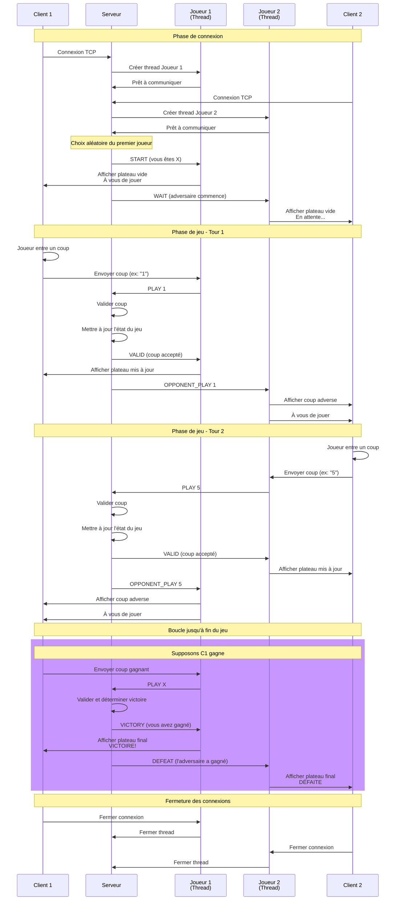

```mermaid
    sequenceDiagram
        participant C1 as Client 1
        participant S as Serveur
        participant J1 as Joueur 1<br/>(Thread)
        participant J2 as Joueur 2<br/>(Thread)
        participant C2 as Client 2
        
        Note over C1,C2: Phase de connexion
        C1->>S: Connexion TCP
        S->>J1: Créer thread Joueur 1
        J1->>S: Prêt à communiquer
        
        C2->>S: Connexion TCP
        S->>J2: Créer thread Joueur 2
        J2->>S: Prêt à communiquer
        
        Note over S: Choix aléatoire du premier joueur
        S->>J1: START (vous êtes X)
        J1->>C1: Afficher plateau vide<br/>À vous de jouer
        S->>J2: WAIT (adversaire commence)
        J2->>C2: Afficher plateau vide<br/>En attente...
        
        Note over C1,C2: Phase de jeu - Tour 1
        C1->>C1: Joueur entre un coup
        C1->>J1: Envoyer coup (ex: "1")
        J1->>S: PLAY 1
        S->>S: Valider coup
        S->>S: Mettre à jour l'état du jeu
        S->>J1: VALID (coup accepté)
        J1->>C1: Afficher plateau mis à jour
        S->>J2: OPPONENT_PLAY 1
        J2->>C2: Afficher coup adverse
        J2->>C2: À vous de jouer
        
        Note over C1,C2: Phase de jeu - Tour 2
        C2->>C2: Joueur entre un coup
        C2->>J2: Envoyer coup (ex: "5")
        J2->>S: PLAY 5
        S->>S: Valider coup
        S->>S: Mettre à jour l'état du jeu
        S->>J2: VALID (coup accepté)
        J2->>C2: Afficher plateau mis à jour
        S->>J1: OPPONENT_PLAY 5
        J1->>C1: Afficher coup adverse
        J1->>C1: À vous de jouer
        
        Note over C1,C2: Boucle jusqu'à fin du jeu
        rect rgb(200, 150, 255)
            Note over C1,C2: Supposons C1 gagne
            C1->>J1: Envoyer coup gagnant
            J1->>S: PLAY X
            S->>S: Valider et déterminer victoire
            S->>J1: VICTORY (vous avez gagné)
            J1->>C1: Afficher plateau final<br/>VICTOIRE!
            S->>J2: DEFEAT (l'adversaire a gagné)
            J2->>C2: Afficher plateau final<br/>DÉFAITE
        end
        
        Note over C1,C2: Fermeture des connexions
        C1->>J1: Fermer connexion
        J1->>S: Fermer thread
        C2->>J2: Fermer connexion
        J2->>S: Fermer thread
```